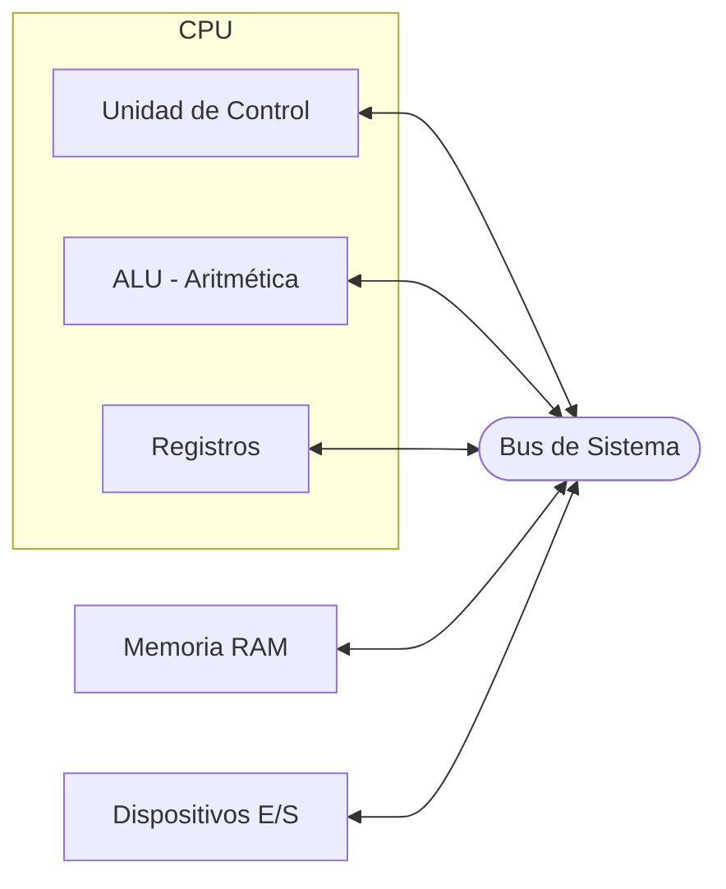

# Tema 1: Arquitectura de Sistemas e Introducción al Hardware

Bienvenidos al primer tema del módulo de **Sistemas Informáticos**. Aquí exploraremos los cimientos físicos y lógicos de cualquier sistema de computación, desde cómo se organiza internamente un ordenador hasta cómo interrogar al hardware desde la terminal de Linux.

---

## 1. Fundamentos de Arquitectura

La arquitectura de un ordenador define **cómo se organizan y comunican** sus componentes internos. Conocerla es imprescindible para tomar decisiones correctas de administración: no podemos asignar recursos que no existen, ni optimizar lo que no entendemos.

### 1.1 Modelo de Von Neumann

Propuesto en 1945, este modelo sigue siendo la base de casi todos los ordenadores actuales. Se compone de cuatro bloques fundamentales:

| Bloque | Función |
|---|---|
| **CPU** | Ejecuta instrucciones lógicas y aritméticas |
| **Memoria Principal (RAM)** | Almacena datos e instrucciones en ejecución (volátil) |
| **Unidades de E/S** | Comunican el sistema con el exterior |
| **Buses** | Canales de comunicación entre bloques |



> **¿Por qué importa esto?** Si un proceso consume toda la RAM, la CPU queda bloqueada esperando datos del disco (swap), degradando el rendimiento drásticamente. Entender el modelo nos ayuda a diagnosticar cuellos de botella.

### 1.2 Tipos de Buses

El bus es la autopista por la que viajan los datos. Existen tres tipos:

- **Bus de Datos**: Transporta los datos entre componentes. Su anchura (8, 16, 32, 64 bits) determina cuántos datos se mueven a la vez.
- **Bus de Direcciones**: Indica la dirección de memoria a la que se quiere acceder. A mayor número de bits, mayor cantidad de memoria direccionable.
- **Bus de Control**: Lleva señales de control (lectura, escritura, interrupciones).

---

## 2. Componentes Internos del Ordenador

### 2.1 La Placa Base (Motherboard)

Es el PCB (Placa de Circuito Impreso) donde se conectan e interconectan **todos** los componentes. Sus elementos clave son:

- **Socket de CPU**: Zócalo donde se inserta el procesador (ej. LGA1700 para Intel, AM5 para AMD).
- **Chipset**: Coordina la comunicación entre el procesador, la RAM y los periféricos. Determina qué CPUs son compatibles con la placa.
- **Slots DIMM**: Ranuras para los módulos de RAM.
- **Slots PCIe**: Para tarjetas de expansión (GPU, NVMe, red).
- **Conectores SATA/M.2**: Para almacenamiento.
- **Chip BIOS/UEFI**: Memoria flash que contiene el firmware de arranque.

### 2.2 El Procesador (CPU)

La CPU realiza millones de operaciones por segundo siguiendo el ciclo **Fetch → Decode → Execute**:

1. **Fetch**: La Unidad de Control busca la siguiente instrucción en la RAM.
2. **Decode**: Descifra qué operación hay que realizar.
3. **Execute**: La ALU ejecuta la operación.

**Parámetros clave a evaluar:**
| Parámetro | ¿Qué indica? |
|---|---|
| Núcleos (Cores) | Cuántas tareas en paralelo puede manejar |
| Frecuencia (GHz) | Velocidad de ejecución de instrucciones |
| Caché (L1/L2/L3) | Memoria ultrarrápida integrada en el chip |
| TDP (Watts) | Calor que disipa (dimensiona el sistema de refrigeración) |
| Soporte VT-x / AMD-V | Virtualización asistida por hardware |

### 2.3 La Memoria RAM

La RAM (Random Access Memory) es una memoria **volátil** y de acceso aleatorio. Al apagar el sistema, su contenido se borra.

- **DDR4 vs DDR5**: Son los estándares actuales. DDR5 ofrece mayor ancho de banda pero a mayor coste.
- **Canal doble (Dual Channel)**: Usar dos módulos iguales duplica el ancho de banda entre CPU y RAM.

:::tip Buena práctica
En servidores Linux de producción, se instala memoria **ECC (Error-Correcting Code)**, que detecta y corrige errores de bits. Evita corrupciones de datos silenciosas.
:::

### 2.4 Almacenamiento Secundario

A diferencia de la RAM, el almacenamiento secundario es **persistente**:

| Tipo | Velocidad | Uso típico |
|---|---|---|
| **HDD** | ~100-150 MB/s | Backups, almacenamiento masivo |
| **SSD SATA** | ~500 MB/s | Sistema operativo y aplicaciones |
| **SSD NVMe (M.2)** | ~3000-7000 MB/s | Cargas de trabajo intensivas (bases de datos, compilación) |

### 2.5 La Fuente de Alimentación (PSU)

Convierte la corriente alterna (AC) de la red eléctrica en corriente continua (DC) a distintos voltajes (+3.3V, +5V, +12V). Su **eficiencia** se mide con certificaciones 80 Plus (Bronze, Gold, Platinum).

> **Regla de oro**: Una PSU de mala calidad puede destruir todos los componentes conectados. Es el componente en el que nunca se debe escatimar.

---

## 3. BIOS y UEFI

La **BIOS** (Basic Input/Output System) es el primer software que se ejecuta al encender un ordenador. Su función es inicializar el hardware (POST - Power On Self Test) y lanzar el cargador del sistema operativo.

La **UEFI** (Unified Extensible Firmware Interface) es su sucesora moderna con varias ventajas:
- Interfaz gráfica e interacción con ratón.
- Soporte para discos GPT (>2TB).
- **Secure Boot**: Verifica la firma digital del bootloader, impidiendo el arranque de software malicioso.
- Arranque más rápido.

### Opciones relevantes en la UEFI para administradores:
- **Orden de arranque**: Definir si arranca desde USB, disco, red (PXE).
- **Virtualización (VT-x / AMD-V)**: Debe estar **habilitada** para usar VirtualBox o VMware.
- **XMP/EXPO**: Perfil de overclock para la RAM (activa la velocidad real del módulo).

---

## 4. Periféricos y Buses de Expansión

Los periféricos se conectan al sistema a través de interfaces estándar:

| Interfaz | Velocidad máx. | Uso |
|---|---|---|
| **USB 3.2 Gen 2** | 10 Gbps | Almacenamiento externo, periféricos |
| **PCIe 4.0 x16** | 32 GB/s | Tarjetas gráficas |
| **HDMI 2.1** | 48 Gbps | Video 4K/8K |
| **Ethernet (1GbE/10GbE)** | 1-10 Gbps | Red local |

---

## 5. Práctica con Linux: Inventariando el Hardware

Cuando administramos un servidor, no siempre tenemos acceso físico a la máquina. Los siguientes comandos nos permiten obtener toda la información del hardware desde la terminal.

### 5.1 Información del Procesador

```bash
# lscpu: Lee /proc/cpuinfo y lo presenta de forma estructurada
lscpu
```

**Salida relevante que debemos interpretar:**
```
Architecture:           x86_64       <- Arquitectura del procesador
CPU(s):                 4            <- Número de CPUs lógicas (núcleos x hilos)
Thread(s) per core:     2            <- Hyperthreading activo
Core(s) per socket:     2            <- Núcleos físicos
Model name:             Intel Core i5-8250U
CPU MHz:                1600.000     <- Frecuencia actual (varía con el escalado)
Virtualization:         VT-x         <- ¡Imprescindible para VMs!
L3 cache:               6144K        <- Caché compartida entre núcleos
```

```bash
# grep nos filtra solo las líneas que contienen "model name" de /proc/cpuinfo
grep "model name" /proc/cpuinfo | uniq
```

> **¿Por qué `uniq`?** `/proc/cpuinfo` repite la información una vez por cada núcleo lógico. `uniq` elimina las líneas duplicadas consecutivas para mostrarlo solo una vez.

### 5.2 Información de la Memoria RAM

```bash
# free muestra el uso de memoria en tiempo real
# La opción -h (human-readable) convierte bytes a GB/MB automáticamente
free -h
```

**Interpretando la salida:**
```
              total    used    free    shared   buff/cache   available
Mem:           7.7G    2.1G    3.2G    120M       2.4G         5.2G
Swap:          2.0G    0.0G    2.0G
```

- `total`: RAM física total instalada.
- `used`: Memoria en uso real.
- `buff/cache`: Memoria usada por el kernel para caché de disco (se libera si hace falta).
- `available`: Memoria que **realmente** podría usar una nueva aplicación.
- `Swap`: Memoria de intercambio en disco (se usa cuando la RAM se agota).

```bash
# dmidecode lee directamente la UEFI/BIOS para obtener info de los módulos físicos
sudo dmidecode --type memory | grep -E "Size|Speed|Type|Locator"
```

> **¿Por qué `sudo`?** `dmidecode` accede a tablas de firmware del hardware, una operación privilegiada. Sin permisos de superusuario, el sistema lo deniega por seguridad.

### 5.3 Información del Almacenamiento

```bash
# lsblk lista los dispositivos de bloque en forma de árbol
lsblk -o NAME,SIZE,TYPE,MOUNTPOINT,FSTYPE
```

**Salida de ejemplo:**
```
NAME   SIZE  TYPE  MOUNTPOINT   FSTYPE
sda    20G   disk
├─sda1  1G   part  /boot        ext4
├─sda2  17G  part  /            ext4
└─sda3  2G   part  [SWAP]       swap
sr0   1024M  rom
```

```bash
# df muestra el espacio usado y libre en los sistemas de archivos montados
df -h

# Para ver el uso de un directorio específico:
du -sh /var/log
```

> **`lsblk` vs `df`**: `lsblk` muestra dispositivos físicos y particiones, existan o no sistema de archivos. `df` solo muestra particiones **montadas** y con sistema de archivos.

### 5.4 Inventario Completo del Hardware

```bash
# lshw (list hardware) genera un informe completo de todo el hardware
# Requiere instalación: sudo apt install lshw
sudo lshw -short
```

```bash
# hwinfo es otra alternativa muy detallada
# Requiere instalación: sudo apt install hwinfo
hwinfo --short
```

```bash
# inxi es ideal para informes rápidos del sistema
# Requiere instalación: sudo apt install inxi
inxi -Fxz
```

---

## 6. Mantenimiento Preventivo del Hardware

Un administrador no solo instala sistemas, también los mantiene.

### Monitorización de Temperatura

```bash
# sensors lee los sensores de temperatura del hardware
# Instalación: sudo apt install lm-sensors && sudo sensors-detect
sensors
```

```bash
# Para SSDs NVMe, usamos smartctl
# Instalación: sudo apt install smartmontools
sudo smartctl -a /dev/nvme0
```

### Ciclo de Mantenimiento Preventivo

| Frecuencia | Tarea |
|---|---|
| Mensual | Revisar logs de errores del sistema (`journalctl -p err`) |
| Trimestral | Comprobar temperatura y limpieza física (polvo) |
| Semestral | Verificar estado S.M.A.R.T. de los discos duros |
| Anual | Revisar capacidad de la batería del SAI |

---

## 7. Actividades Prácticas

### Actividad 1: Informe de Hardware
Ejecuta los siguientes comandos en tu VM Ubuntu y documenta los resultados en un archivo de texto:

```bash
# Creamos el directorio para guardar el informe
mkdir -p ~/informes

# Generamos el informe y lo redirigimos a un archivo
{
  echo "=== CPU ==="
  lscpu | grep -E "Model name|CPU\(s\)|Thread|Core|Virtualization"
  echo ""
  echo "=== MEMORIA ==="
  free -h
  echo ""
  echo "=== DISCO ==="
  lsblk -o NAME,SIZE,TYPE,MOUNTPOINT
  echo ""
  echo "=== SISTEMA OPERATIVO ==="
  uname -a
  cat /etc/os-release | grep PRETTY_NAME
} > ~/informes/hardware_$(date +%Y%m%d).txt

echo "Informe generado en ~/informes/"
cat ~/informes/hardware_$(date +%Y%m%d).txt
```

> **Concepto clave**: El operador `>` redirige la salida estándar de un comando a un archivo (lo sobreescribe). `>>` añade al final sin borrar. `{}` agrupa varios comandos para redirigir su salida conjunta.

### Actividad 2: Investigación
Investiga qué procesador, cantidad de RAM y tipo de disco (HDD/SSD) tiene el ordenador que estás usando. Compara las características con las recomendaciones mínimas de Ubuntu 24.04 LTS y responde:
1. ¿Cumple los requisitos para instalar Ubuntu?
2. ¿Soporta virtualización? (Busca en la UEFI o con `lscpu`).
3. ¿Qué mejorarías del equipo y por qué?

---

## 8. Resumen del Tema

- La **arquitectura Von Neumann** es la base de los ordenadores modernos: CPU, RAM, E/S y buses.
- La **UEFI** ha reemplazado a la BIOS, añadiendo soporte para discos grandes, Secure Boot y una interfaz gráfica.
- En Linux podemos obtener toda la información del hardware con comandos como `lscpu`, `free`, `lsblk`, `dmidecode` y `lshw`.
- El **mantenimiento preventivo** (temperatura, S.M.A.R.T., logs) evita fallos catastróficos en producción.
